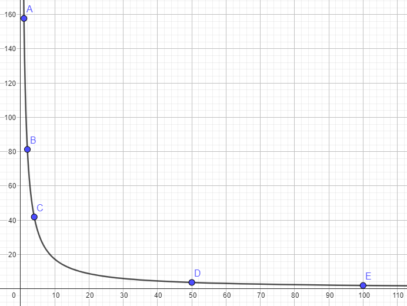

### Escuela Colombiana de Ingeniería
### Arquitecturas de Software - ARSW
## Ejercicio Introducción al paralelismo - Hilos - Caso BlackListSearch

### Dependencias:
####   Lecturas:
*  [Threads in Java](http://beginnersbook.com/2013/03/java-threads/)  (Hasta 'Ending Threads')
*  [Threads vs Processes]( http://cs-fundamentals.com/tech-interview/java/differences-between-thread-and-process-in-java.php)

### Descripción
  Este ejercicio contiene una introducción a la programación con hilos en Java, además de la aplicación a un caso concreto.
  

**Parte I - Introducción a Hilos en Java**

1. De acuerdo con lo revisado en las lecturas, complete las clases CountThread, para que las mismas definan el ciclo de vida de un hilo que imprima por pantalla los números entre A y B.
2. Complete el método __main__ de la clase CountMainThreads para que:
	1. Cree 3 hilos de tipo CountThread, asignándole al primero el intervalo [0..99], al segundo [99..199], y al tercero [200..299].
	2. Inicie los tres hilos con 'start()'.
	3. Ejecute y revise la salida por pantalla. 
	4. Cambie el incio con 'start()' por 'run()'. Cómo cambia la salida?, por qué?. \
   	   _Cuando se realiza el inicio la forma de impresion del ciclo cambia._ \
	   _Con 'start()' los numeros se imprimen desordenadamente dando una nocion de que el proceso se esta realizando con paralelismo presente._
   	   _Mientras que con run() los numeros se imprimen secuencialmente a como se diseño la ejecucion dado por el contrario una nocion de que el ´proceso se esta realizando concurrentemente._ \
       _Esto se da ya que el metodo start() crea un nuevo hilo del sistema y llama al metodo run() en este hilo. Por otro lado, el metodo run() solo define el comportamiento del hilo, pero no lo inicia. Si se llama al metodo run() directamente, el codigo se ejecutara en el hilo actual, no en un nuevo hilo._

**Parte II - Ejercicio Black List Search**

Para un software de vigilancia automática de seguridad informática se está desarrollando un componente encargado de validar las direcciones IP en varios miles de listas negras (de host maliciosos) conocidas, y reportar aquellas que existan en al menos cinco de dichas listas. 

Dicho componente está diseñado de acuerdo con el siguiente diagrama, donde:

- HostBlackListsDataSourceFacade es una clase que ofrece una 'fachada' para realizar consultas en cualquiera de las N listas negras registradas (método 'isInBlacklistServer'), y que permite también hacer un reporte a una base de datos local de cuando una dirección IP se considera peligrosa. Esta clase NO ES MODIFICABLE, pero se sabe que es 'Thread-Safe'.

- HostBlackListsValidator es una clase que ofrece el método 'checkHost', el cual, a través de la clase 'HostBlackListDataSourceFacade', valida en cada una de las listas negras un host determinado. En dicho método está considerada la política de que al encontrarse un HOST en al menos cinco listas negras, el mismo será registrado como 'no confiable', o como 'confiable' en caso contrario. Adicionalmente, retornará la lista de los números de las 'listas negras' en donde se encontró registrado el HOST.

Al usarse el módulo, la evidencia de que se hizo el registro como 'confiable' o 'no confiable' se dá por lo mensajes de LOGs:

INFO: HOST 205.24.34.55 Reported as trustworthy

INFO: HOST 205.24.34.55 Reported as NOT trustworthy

Al programa de prueba provisto (Main), le toma sólo algunos segundos análizar y reportar la dirección provista (200.24.34.55), ya que la misma está registrada más de cinco veces en los primeros servidores, por lo que no requiere recorrerlos todos. Sin embargo, hacer la búsqueda en casos donde NO hay reportes, o donde los mismos están dispersos en las miles de listas negras, toma bastante tiempo.

Éste, como cualquier método de búsqueda, puede verse como un problema [vergonzosamente paralelo](https://en.wikipedia.org/wiki/Embarrassingly_parallel), ya que no existen dependencias entre una partición del problema y otra.

Para 'refactorizar' este código, y hacer que explote la capacidad multi-núcleo de la CPU del equipo, realice lo siguiente:

1. Cree una clase de tipo Thread que represente el ciclo de vida de un hilo que haga la búsqueda de un segmento del conjunto de servidores disponibles. Agregue a dicha clase un método que permita 'preguntarle' a las instancias del mismo (los hilos) cuantas ocurrencias de servidores maliciosos ha encontrado o encontró.

2. Agregue al método 'checkHost' un parámetro entero N, correspondiente al número de hilos entre los que se va a realizar la búsqueda (recuerde tener en cuenta si N es par o impar!). Modifique el código de este método para que divida el espacio de búsqueda entre las N partes indicadas, y paralelice la búsqueda a través de N hilos. Haga que dicha función espere hasta que los N hilos terminen de resolver su respectivo sub-problema, agregue las ocurrencias encontradas por cada hilo a la lista que retorna el método, y entonces calcule (sumando el total de ocurrencuas encontradas por cada hilo) si el número de ocurrencias es mayor o igual a _BLACK_LIST_ALARM_COUNT_. Si se da este caso, al final se DEBE reportar el host como confiable o no confiable, y mostrar el listado con los números de las listas negras respectivas. Para lograr este comportamiento de 'espera' revise el método [join](https://docs.oracle.com/javase/tutorial/essential/concurrency/join.html) del API de concurrencia de Java. Tenga también en cuenta:

	* Dentro del método checkHost Se debe mantener el LOG que informa, antes de retornar el resultado, el número de listas negras revisadas VS. el número de listas negras total (línea 60). Se debe garantizar que dicha información sea verídica bajo el nuevo esquema de procesamiento en paralelo planteado.

	* Se sabe que el HOST 202.24.34.55 está reportado en listas negras de una forma más dispersa, y que el host 212.24.24.55 NO está en ninguna lista negra.

**Parte II.I Para discutir la próxima clase (NO para implementar aún)**

La estrategia de paralelismo antes implementada es ineficiente en ciertos casos, pues la búsqueda se sigue realizando aún cuando los N hilos (en su conjunto) ya hayan encontrado el número mínimo de ocurrencias requeridas para reportar al servidor como malicioso. Cómo se podría modificar la implementación para minimizar el número de consultas en estos casos?, qué elemento nuevo traería esto al problema? \
_Se puede bien crear una variable compartida que lleve un seguimiento del número total de ocurrencias encontradas por todos los hilos. Inicialízala a cero antes de comenzar la búsqueda._ \
_Como tambien actualizar la variable de ocurrencias totales en cada hilo, cada vez que un hilo encuentra una ocurrencia, actualiza esta variable compartida de ocurrencias totales. Asegurándose de que esta actualización se realice de manera segura para hilos (sincronizada o utilizando mecanismos de concurrencia apropiados)._ \
_O bien se podría introducir una condición de parada anticipada, donde antes de iniciar una nueva búsqueda en un servidor dentro de un hilo, verifica si la cantidad mínima de ocurrencias requeridas ya se ha alcanzado. Si es así, se detiene el hilo de inmediato para evitar búsquedas adicionales innecesarias._ \
_Trayendo a colación conceptos importantes para la concurrencia, como lo son sincronización y Thread-Safe._  

**Parte III - Evaluación de Desempeño**

A partir de lo anterior, implemente la siguiente secuencia de experimentos para realizar las validación de direcciones IP dispersas (por ejemplo 202.24.34.55), tomando los tiempos de ejecución de los mismos (asegúrese de hacerlos en la misma máquina):

1. Un solo hilo. _Execution time: 157.74 seconds_
2. Tantos hilos como núcleos de procesamiento (haga que el programa determine esto haciendo uso del [API Runtime](https://docs.oracle.com/javase/7/docs/api/java/lang/Runtime.html)). _Execution time: 81.292 seconds_
3. Tantos hilos como el doble de núcleos de procesamiento. _Execution time: 41.867 seconds_
4. 50 hilos. _Execution time: 3.653 seconds_
5. 100 hilos. _Execution time: 1.894 seconds_

Al iniciar el programa ejecute el monitor jVisualVM, y a medida que corran las pruebas, revise y anote el consumo de CPU y de memoria en cada caso. 

Con lo anterior, y con los tiempos de ejecución dados, haga una gráfica de tiempo de solución vs. número de hilos. Analice y plantee hipótesis con su compañero para las siguientes preguntas (puede tener en cuenta lo reportado por jVisualVM): \
	 \
**Parte IV - Ejercicio Black List Search**

1. Según la [ley de Amdahls](https://www.pugetsystems.com/labs/articles/Estimating-CPU-Performance-using-Amdahls-Law-619/#WhatisAmdahlsLaw?):

	, donde _S(n)_ es el mejoramiento teórico del desempeño, _P_ la fracción paralelizable del algoritmo, y _n_ el número de hilos, a mayor _n_, mayor debería ser dicha mejora. Por qué el mejor desempeño no se logra con los 500 hilos?, cómo se compara este desempeño cuando se usan 200?.
	* _La Ley de Amdahl establece que el mejoramiento teórico del rendimiento de un programa paralelizado se limita por la fracción secuencial del algoritmo. En otras palabras, aunque puedas agregar más hilos para paralelizar una tarea, si una parte significativa del algoritmo aún se ejecuta de forma secuencial, entonces el rendimiento total no mejorará de manera significativa a medida que aumentes el número de hilos._
	* _Cuando se tienen 500 hilos, la fracción paralelizable del algoritmo (F) no es lo suficientemente grande, es decir, si aún existe una cantidad significativa de trabajo secuencial, entonces la Ley de Amdahl nos dice que el rendimiento no mejorará drásticamente, incluso con un gran número de hilos. Esto significa que el costo de administrar y coordinar 500 hilos puede superar cualquier ganancia en rendimiento debido a la paralelización._
	* _Con 200 hilos, se experimenta una mejora en el rendimiento en comparación con 500 hilos ya que la administración y la sobrecarga de hilos se reducen significativamente. Sin embargo, aún se limitará en gran medida por la fracción secuencial del algoritmo (1−F). En general, 200 hilos pueden ser más manejables y eficientes en términos de recursos que 500 hilos, y aún podrían proporcionar un rendimiento razonable si la fracción paralelizable (F) es suficientemente grande._ 
2. Cómo se comporta la solución usando tantos hilos de procesamiento como núcleos comparado con el resultado de usar el doble de éste?.
	* **Usar tantos hilos como núcleos de la CPU** _En este escenario, se está utilizando eficientemente los recursos de la CPU al tener un hilo por cada núcleo físico de la CPU. Esto puede ser beneficioso para tareas altamente paralelizables, donde cada hilo puede trabajar de manera independiente y no necesita esperar a otros hilos. Si el problema es altamente paralelizable y la administración de hilos se realiza eficientemente, es posible lograr una buena utilización de la CPU y una aceleración significativa en comparación con la ejecución secuencial._
    * **Usar el doble de hilos que núcleos de la CPU** _Cuando el problema es altamente paralelizable, como en este caso, y la administración de hilos se realiza eficientemente, se puede lograr una aceleración significativa al usar más hilos. Esto podría ser beneficioso si hay tareas de E/S (entrada/salida) que pueden ejecutarse en paralelo con el procesamiento principal, lo que permite aprovechar al máximo la CPU mientras los hilos principales están ocupados._
3. De acuerdo con lo anterior, si para este problema en lugar de 100 hilos en una sola CPU se pudiera usar 1 hilo en cada una de 100 máquinas hipotéticas, la ley de Amdahls se aplicaría mejor?. Si en lugar de esto se usaran c hilos en 100/c máquinas distribuidas (siendo c es el número de núcleos de dichas máquinas), se mejoraría?. Explique su respuesta.
	* 1 hilo en cada una de las 100 máquinas hipotéticas es más eficiente y aprovecha mejor la paralelización si el problema es altamente paralelizable como en este caso.
	* Usar c hilos en 100/c máquinas distribuidas podría aumentar la complejidad y la sobrecarga de comunicación sin proporcionar una mejora significativa en el rendimiento. 

